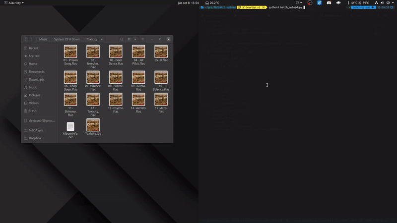

<div align="center">
  <h1>LBRY Batch Upload</h1>
  <p>Automate uploading entire folders to <a href="https://lbry.tv" target="_blank">lbry.tv</a></p>
</div>

<div align="center">
  
</div>

## Table of Contents

- [Prerequisites](#prerequisites)
- [Usage](#usage)
- [Configuration](#configuration)
- [Changelog](#changelog)
- [License](#license)

## Prerequisites

- The [`chromedriver` executable](https://sites.google.com/a/chromium.org/chromedriver/home) needs to be available in `$PATH`.
- Fill [config.toml] before running the script
- Use an absolute `folder_path`
- Song titles must match the format `{number} - {title}.{format}`
- The thumbnail must have the same name as the album
- If your file explorer is not `Nautilus`, the _browse_ actions might not work
- Folder structure as follows

  > Files should be in a folder which is named after the album, inside a
  > folder that is named after the artist.

  ```bash
  .
  └── Red Hot Chili Peppers
      └── Californication
          ├── 01 - Around the World.flac
          ├── 02 - Parallel Universe.flac
          ├── 03 - Scar Tissue.flac
          ├── 04 - Otherside.flac
          ├── 05 - Get on Top.flac
          ├── 06 - Californication.flac
          ├── 07 - Easily.flac
          ├── 08 - Porcelain.flac
          ├── 09 - Emit Remmus.flac
          ├── 10 - I Like Dirt.flac
          ├── 11 - This Velvet Glove.flac
          ├── 12 - Savior.flac
          ├── 13 - Purple Stain.flac
          ├── 14 - Right on Time.flac
          ├── 15 - Road Trippin.flac
          ├── album_info.txt
          └── Californication.jpg
  ```

## Usage

- Clone the repo

  ```text
  git clone https://github.com/ibLeDy/lbry-batch-upload.git && \
  cd lbry-batch-upload
  ```

- Create a virtual enviroment and activate it

  ```text
  python3 -m virtualenv .venv && \
  source .venv/bin/activate
  ```

- Install the requirements

  ```sh
  pip install -r requirements.txt
  ```

- Fill the [config](./config.toml)

- Run the script

  ```sh
  python lbry_batch_upload.py
  ```

## Configuration

- `user`
  - `email`
    > the email you log in with, (see how it is used on line [89](./lbry_batch_upload.py#L89))
  - `password`
    > the password you log in with, (see how it is used on line [92](./lbry_batch_upload.py#L92))

- `files`
  - `folder_path`
    > full (absolute) path to the album folder
  - `audio_format`
    > the extension of the audio files (`.mp3`, `.flac`, ...)
  - `thumbnail_format`
    > the extension of the thumbnail (`.jpg`, `.png`, ...)
  - `excluded`
    > files that you **don't** want to upload

- `upload`
  - `description`
    > multi-line string with the description
  - `tags`
    > up to 5
  - `channel`
    > exact name as it appears on the channels list
  - `deposit`
    > floating point number
  - `price`
    > floating point number or **false** if you don't want to set a price
  - `language`
    > two-character language code (`en`, `es`, ...)
  - `license_type`
    > license name, as it appears on the dropdown menu of an upload
  - `license_notice`
    > text for the license notice

## Changelog

- October 8, 2020:
  - Fix outdated selectors
  - Account for lbry's new upload confirmation popup
  - Use thumbnail file inside the album folder instead of a url
  - Delete `thumbnail_url` from upload section in config
  - Add `thumbnail_format` to files section in config
  - Don't use `-` separator between song number and name

- September 14, 2020:
  - Basic validation for `language` and `license_type`

- September 10, 2020:
  - Closing the success popup is more reliable
  - Selecting files is more reliable
  - Fix outdated selectors
  - Use ASCII in claim name

- July 24, 2020:
  - Changelog is now in reverse chronological order

- June 17, 2020:
  - Use toml instead of json for config file: `config.json -> config.toml`
  - Define constants to catch basic config errors
  - Replace `None` checks with existence ones

- June 16, 2020:
  - Rename settings file: `upload_settings.json -> config.json`
  - Handle closing success upload popup with a custom decorator
  - Add missing decorator to some functions
  - Rename base class for pages `PageObject -> BasePage`
  - Separate clicking and filling info so we can resume when a popup was detected
  - Add sleep before uploading next file so they get uploaded in order

- June 13, 2020:
  - Handle `price` option, only LBC atm

- June 12, 2020:
  - Change webdriver to improve speed: `Firefox -> Chrome`
  - Change settings file name: `settings.json -> upload_settings.json`
  - Move credentials from `.env` to `upload_settings.json`
  - Remove `python-dotenv` requirement
  - Implement PageObject pattern
  - Remove `price` from settings until i manage to circunvent an obstructing label
  - Bump wait time before and after file selection to 1s

## License

This project is licensed under the terms of the
[MIT](https://choosealicense.com/licenses/mit/) license.

<div align="right">
  <b><a href="#lbry-batch-upload">↥ back to top</a></b>
</div>
